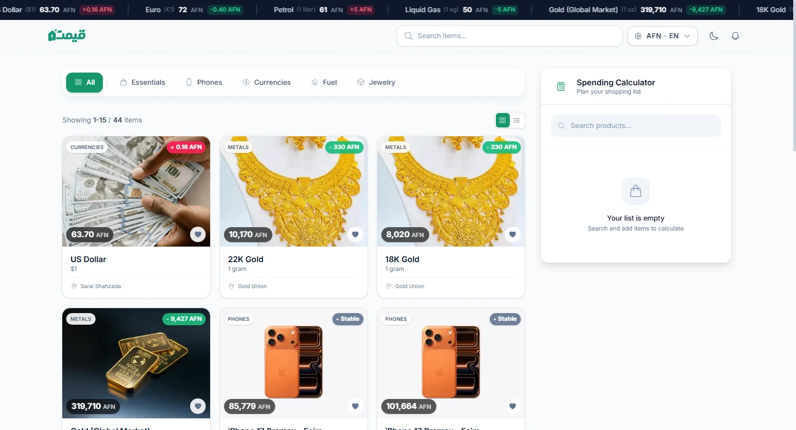
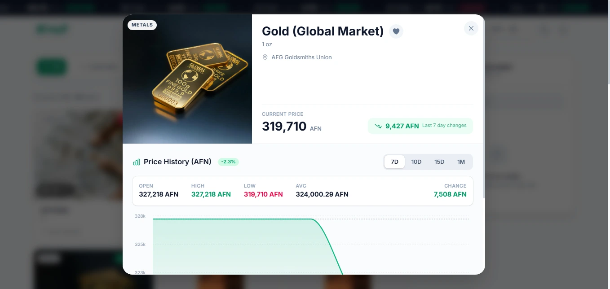
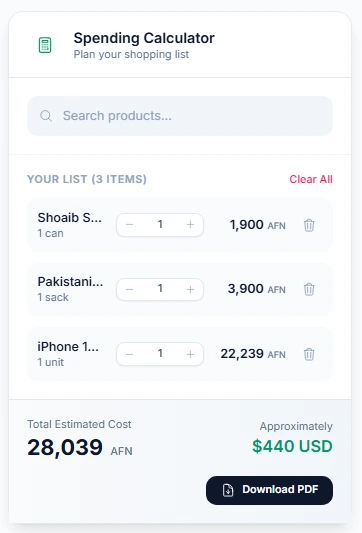

<div align="center">
  

# Qimat

**Real-time market price tracking for Afghanistan**

A multilingual Progressive Web App (PWA) for monitoring daily prices of essentials, fuel, currencies, and electronics across Afghan markets.

[](https://nextjs.org/)
[](https://react.dev/)
[](https://tailwindcss.com/)
[](https://turso.tech/)
[](LICENSE)

[Live Demo](https://qimat.vercel.app) · [Report Bug](https://github.com/shahreyarhabibi/qimat/issues) · [Request Feature](https://github.com/shahreyarhabibi/qimat/issues)

</div>

---

## Project Overview

Qimat (قیمت) means "price" in Dari/Pashto. The app gives people in Afghanistan quick access to current market prices so they can make better buying decisions.

Prices for essentials and daily-use products can change frequently. Qimat brings this data into one fast, mobile-first platform.

### Why Qimat?

- **Price Transparency**: Monitor daily price changes for essentials, fuel, and currencies
- **Mobile-First**: Optimized for smartphone users
- **PWA Ready**: Installable web app with service worker support
- **Multilingual**: Supports Farsi (فارسی), Pashto (پښتو), and English

---

## Features

### For Users

| Feature             | Description                                      |
| ------------------- | ------------------------------------------------ |
| Price Tracking      | View current prices with daily change indicators |
| Price History       | Interactive 7-30 day trend charts                |
| Search and Filter   | Find products by name and category               |
| Favorites           | Pin frequently checked products                  |
| Multi-Currency      | Display prices in AFN, USD, or EUR               |
| Spending Calculator | Quantity presets with PDF export                 |
| Notifications       | Browser/push alerts for price changes            |
| Dark Mode           | Light and dark themes                            |
| PWA Support         | Install app to home screen                       |
| Multilingual UI     | Farsi, Pashto, and English                       |

### For Administrators

| Feature              | Description                               |
| -------------------- | ----------------------------------------- |
| Secure Login         | JWT-based admin authentication            |
| Product Management   | Create, edit, and manage products         |
| Bulk Price Updates   | Update prices for multiple products       |
| Category Management  | Organize products by category             |
| Source Management    | Manage market/source locations            |
| Ticker Configuration | Control items shown in top ticker         |
| Analytics            | View visits, stale products, and activity |

---

## Tech Stack

### Frontend

- **Framework:** [Next.js 16](https://nextjs.org/) (App Router)
- **UI Library:** [React 19](https://react.dev/)
- **Styling:** [Tailwind CSS 4](https://tailwindcss.com/)
- **Data Fetching:** [SWR](https://swr.vercel.app/)
- **Charts:** [Recharts](https://recharts.org/)
- **PDF Export:** [jsPDF](https://github.com/parallax/jsPDF) + [jsPDF-AutoTable](https://github.com/simonbengtsson/jsPDF-AutoTable)
- **Icons:** [Heroicons](https://heroicons.com/)

### Backend

- **Database:** [Turso](https://turso.tech/) (libSQL)
- **ORM:** [Drizzle ORM](https://orm.drizzle.team/)
- **Authentication:** JWT + HTTP-only cookies
- **Push Notifications:** Web Push (VAPID)

### Infrastructure

- **Hosting:** [Vercel](https://vercel.com/) (recommended)
- **PWA:** Service Worker + Web App Manifest

---

## Screenshots

<div align="center">
  <i>Project screenshots</i>
</div>

|                 Home Page                  |                  Product Details                  |                    Spending Calculator                     |
| :----------------------------------------: | :-----------------------------------------------: | :--------------------------------------------------------: |
|  |  |  |

---

## Installation

### Prerequisites

- [Node.js](https://nodejs.org/) 18.17 or later
- npm or pnpm
- [Turso CLI](https://docs.turso.tech/cli/installation) (if you manage DB manually)

### Clone the Repository

```bash
git clone https://github.com/yourusername/qimat.git
cd qimat
```

### Install Dependencies

```bash
npm install
# or
pnpm install
```

### Push Database Schema

```bash
npm run db:push
```

### Seed Initial Data (Optional)

```bash
npm run db:seed
```

---

## Environment Variables

Create `.env.local` in the project root:

```bash
# Database
TURSO_DATABASE_URL=libsql://your-db-name.turso.io
TURSO_AUTH_TOKEN=your-auth-token

# Admin Auth
JWT_SECRET=your-secure-random-string-min-32-chars
ADMIN_USERNAME=admin
ADMIN_PASSWORD=your-secure-admin-password

# Push Notifications
NEXT_PUBLIC_VAPID_PUBLIC_KEY=your-vapid-public-key
VAPID_PRIVATE_KEY=your-vapid-private-key
VAPID_SUBJECT=mailto:your-email@example.com
```

### Generate VAPID Keys

```bash
npx web-push generate-vapid-keys
```

---

## Running Locally

### Development

```bash
npm run dev
```

Open `http://localhost:3000`.

### Production

```bash
npm run build
npm run start
```

---

## License

This project is licensed under the MIT License. See `LICENSE` for details.
